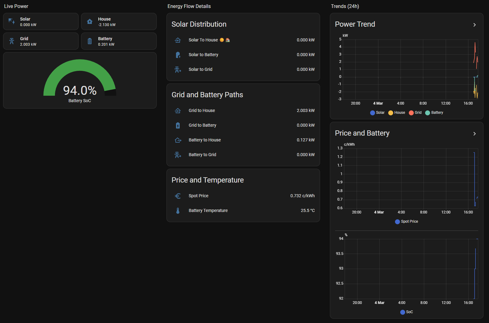
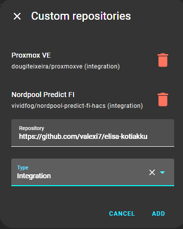
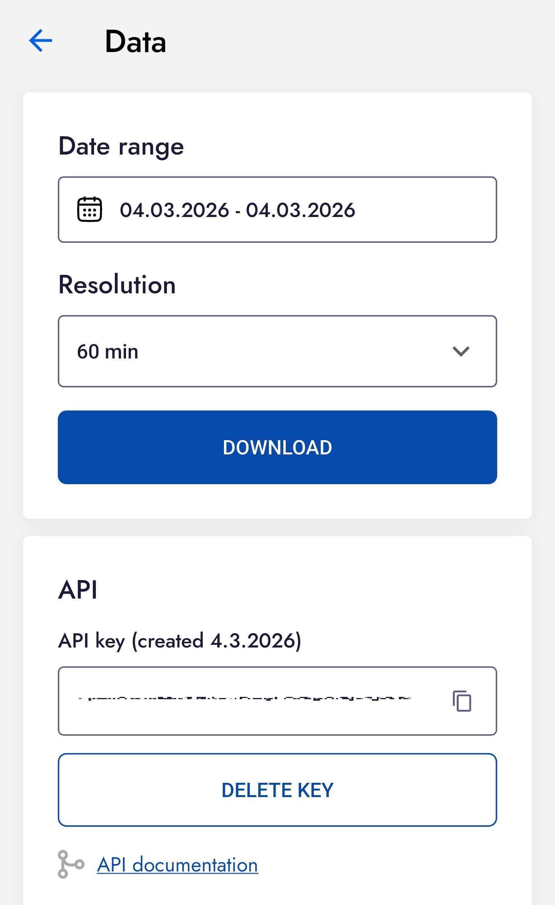

# Elisa Kotiakku Home Assistant Custom Component

[](https://github.com/hacs/integration)
[](https://my.home-assistant.io/redirect/hacs_repository/?owner=valexi7&repository=elisa-kotiakku&category=integration)
[](https://www.paypal.com/donate/?business=DS47TSR4VGKFL&no_recurring=0&item_name=Tech+is+a+playground+for+solving+real-world+problems+and+building+tools+that+make+life+easier+for+others.&currency_code=EUR)
[](https://www.buymeacoffee.com/valexi)


Custom integration for Home Assistant that reads your Elisa Kotiakku data from:
- `https://residential.gridle.com/api/public/measurements`
- Authentication header: `x-api-key: <your_api_key>`

## Features

- Config Flow UI setup (no YAML required)
- Automatic sensor creation for all public API measurement variables
- Correct units and device classes
- Emoji-enhanced sensor names for quick dashboard readability
- Period metadata (`period_start`, `period_end`) in sensor attributes

## Installation

### Install with HACS



1. Open HACS in Home Assistant.
2. Go to `Integrations`.
3. Open the menu (three dots) and select `Custom repositories`.
4. Add this repository URL and select category `Integration`.
5. Search for `Elisa Kotiakku` in HACS and install it.
6. Restart Home Assistant.
7. Go to `Settings -> Devices & Services -> Add Integration`.
8. Search for `Elisa Kotiakku` and open it.
9. Enter your API key.



### HACS Requirements

- HACS must already be installed in Home Assistant.
- This repository needs to be available as a public GitHub repository for HACS custom repository installation.

## API Key

Create your API key in the Kotiakku app:

- `Settings -> Data -> API`

## Sensors Created

The integration creates sensors for:

- `battery_power_kw` (`kW`)
- `state_of_charge_percent` (`%`)
- `solar_power_kw` (`kW`)
- `grid_power_kw` (`kW`)
- `house_power_kw` (`kW`)
- `solar_to_house_kw` (`kW`)
- `solar_to_battery_kw` (`kW`)
- `solar_to_grid_kw` (`kW`)
- `grid_to_house_kw` (`kW`)
- `grid_to_battery_kw` (`kW`)
- `battery_to_house_kw` (`kW`)
- `battery_to_grid_kw` (`kW`)
- `spot_price_cents_per_kwh` (`c/kWh`)
- `battery_temperature_celsius` (`°C`)

It also creates cumulative energy sensors (Energy Dashboard compatible):

- `sensor.solar_energy`
- `sensor.house_consumption_energy`
- `sensor.grid_import_energy`
- `sensor.grid_export_energy`
- `sensor.battery_charge_energy`
- `sensor.battery_discharge_energy`

These use `kWh`, `device_class: energy`, and `state_class: total_increasing`.

It also creates live derived power sensors:

- `sensor.grid_consumption`
- `sensor.grid_production`
- `sensor.battery_consumption`
- `sensor.battery_production`

Diagnostic sensors:

- `sensor.sensor_data_available` (`True`/`False`)

## Dashboard YAML Example

This repository includes a ready example view:

- `examples/dashboard_elisa_kotiakku.yaml`


The example matches the picture and uses these custom cards:

- `power-flow-card-plus`
- `mushroom` cards
- `plotly-graph`

Quick use:

1. Open your dashboard in edit mode.
2. Add a new view and switch to YAML mode.
3. Paste the content from `examples/dashboard_elisa_kotiakku.yaml`.
4. Adjust entity IDs if your names differ.

If you do not use those custom cards, replace them with standard HA cards.

Default entity IDs from this integration are name-based, for example:

- `sensor.battery_power`
- `sensor.solar_power`
- `sensor.grid_power`
- `sensor.house_power`
- `sensor.battery_state_of_charge`
- `sensor.spot_price`
- `sensor.battery_temperature`

Example snippet:

```yaml
title: Elisa Kotiakku
path: elisa-kotiakku
type: sections
icon: mdi:home-battery
sections:
  - type: grid
    cards:
      - type: heading
        heading: Live Power
      - type: tile
        entity: sensor.solar_power
      - type: tile
        entity: sensor.house_power
      - type: tile
        entity: sensor.grid_power
      - type: tile
        entity: sensor.battery_power
```

## Notes

- API data is polled every 30 seconds.
- If the latest row has `null` values for a field, that sensor becomes temporarily unavailable.
- Energy sensors are accumulated from each API period (`period_start` -> `period_end`) and restored after restart.
- If the API is reachable but latest measurement values are all `null`, a warning is logged that inverter connection may be lost.
- If the API connection itself fails (timeout/network), an error is logged that API connection is lost.

## Troubleshooting

- Integration icon missing in HACS/Devices:
  The integration now ships a square `brand/icon.png` (512x512). Restart Home Assistant and hard refresh browser cache (`Ctrl+F5`). HACS/brand icons can also be cached for a while.
